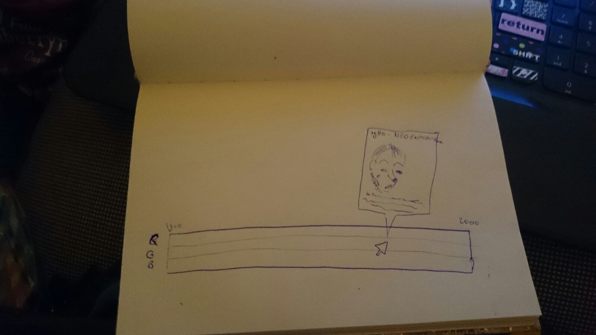

# programmeerproject

Met mijn programmeerproject wil ik de kleurevolutie in de kunst van de 20ste eeuw visualiseren. Een kleur is op te delen in rood, groen en blauw. De 20ste eeuw  is een erg interestante eeuw in de kunstgeschiedenis. Veel verschillende stijlen volgden elkaar in rap tempo op. Een kenmerk van een nieuwe stijl gaat vaak gepaard met een ander kleurgebruik (verschillende tinten). Een kleur is opgedeeld in rood, groen en blauw. Ik wil in mijn project laten zien welke tinten van deze drie basiskleuren kenmerkend waren voor de tijdsperiode.
Er is veel onderzoek gedaan naar kunststromingen in de 20ste eeuw. Ik zal dus informatie moeten vinden over het kleurgebruik van deze stromingen. Er zijn veel papers geschreven. Misschien is het zelfs mogelijk zelf schilderijen te analyseren (maar dat  kost ook tijd). Daarnaast heb ik natuurlijk de data nodig over de periodes van de verschillende kunststromingen maar deze is makkelijk te vinden. En wil ik van elke stroming een kenmerkend schilderij, misschien dat ik dat moet opslaan of moet opzoeken wanneer erom gevraagd wordt.
Mijn aanpak bestaat uit: 1. Het vergaren van de data over de kleurevoltie. 2. Het maken van een tijdsbalk gevuld met kleuren die in elkaar overlopen. 3. Deze interactief maken, wanneer je over de balk hoverd krijg je informatie over de stroming waar de muis is beland. (wat zegt het kleurgebruik over de tijdgeest)
Wanneer ik mezelf de vraag stel welk technisch probleem ik het meeste tegenaan zal lopen dan is dat waarschijnlijk het vinden van de juiste data over het kleurgebruik. Hoe dan ook ik ben ervan overtuigd dat het niet onmogelijk is.
Ik heb gezocht voor een voorbeeld waarin ik zie hoe een tijdslijn kan worden gemaakt. Met de link http://bl.ocks.org/rengel-de/5603464 zie je hoe er in d3 een tijdslijn wordt gemaakt. Hierbij staan beroemde personen op de as. Bij mij zal het gaan om kleuren waardoor de grafiek er een heel stuk simpeler uit gaat zien.
Op deze link vind ik manieren om de kleuren van een foto te analyseren: http://mkweb.bcgsc.ca/color-summarizer/

Hieronder volgt een schets van hoe ik graag wil dat mijn visualisatie eruit zal zien:

