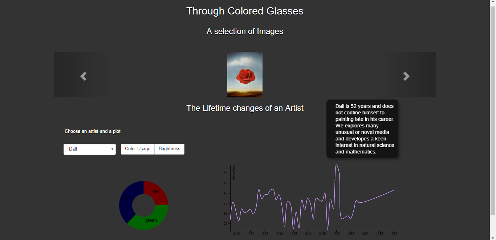

# Door een gekleurde bril

## ReadMe

Mijn project heeft is een visualisatie van de evaluatie in kleurgebruik en helderheid van drie verschillende kunstenaars die in de 20ste eeuw geleefd hebben. De gebruiker heeft de keuze tussen Salvador Dali, Paul Klee en Frieda Kahlo. Elk datapunt is gebaseerd op minstens 3 schilderijen die er bekent zijn in het desbetreffende jaar.

## Design

### Data verzamelen

**Rgbvalue.py** is een script dat gebruikt wordt om afbeeldingen uit een gewenste map te analyseren betreffende de rgb waarde. Het programma werkt als volgt. Handmatig moet de naam van de folder in het script worden gezet op regel 13. De naam is een string. Vervolgens wordt er geïtereerd over alle files in e folder en van elk file wordt pixel voor pixel de rgb waarde bepaald. Na alle pixels te hebben bekeken wordt het gemiddelde berekend. Dat is dus de rgb waarde van de afbeelding. Het is belangrijk dat de namen van de afbeeldingen er als volgt uitzien: yyyy.jpg of yyyy (x).jpg waarin yyyy het jaartal is en x het hoeveelste schilderij in dat jaartal. Er zijn twee verschillende jsonfiles waar de waardes naartoe worden geschreven. De een heeft de rgb waardes per jaar opgeslagen de ander heeft de rgb waardes per schilderij opgeslagen.

### Data structuur

Om te beginnen bestaan er drie verschillende mappen met afbeeldingen. De naam van de afbeeldingen is altijd yyyy.jpg of yyyy (x).jpg. Waar yyyy het jaar is waarin het schilderij is gemaakt en x het hoeveelste schilderij dat is gemaakt dat jaar. Daarnaast zijn er per schilder twee jsonfiles; een met de rgb waardes per schilderij, de andere met de rgb waardes per jaar. Tot slot is er voor elke schilder een tsv bestand met daarin de belangrijkste gebeurtenissen uit het leven van de schilder.

### html en javascript

In **plots.html** worden de verschillende libaries ingeladen. Het programma maakt gebruik van bootstrap en daarom ook van ajax. Daarnaast wordt de standaard d3 libarie ingeladen en een uitbereiding met tooltip. Eerst wordt de carrousel gemaakt met standaard drie fotos (van elke kunstenaar een) later wordt er een selectie van schilderijen van een gekozen jaar afgebeeld.  In de containerclass wordt de dropdown gemaakt waarin je tussen verschillende kunstenaars kunt kiezen en de knoppen waarin je kunt kiezen tussen verschillende data. Ook worden er area1, voor de areagraph en de linechart, en area 2, voor de donutchart, gemaakt

**bril.js** is opgebouwd uit vier functies. Deze functies tekenen de twee belangrijkste plots: De colorplot, dit is de plot die het kleurgebruik van de schilder door de jaren heen laat zien. En de brightplot, dit is de plot die de helderheid van de schilderijen door de jaren heen laat zien. Wanneer je op een van de grafieken klikt wordt maketips aangeroepen. Deze functie zorgt eventueel voor een tooltip en veranderd alle schilderijen in de carrousel. De schilderijen die worden weergegeven zijn schilderijen van de kunstenaar uit het desbetreffende jaar. Wanneer men op een schilderij wordt de clicker aangeroepen waarin het rood, groen en blauw gebruik van dat schilderij wordt weergegeven.

In bril.js bestaan twee globale variabelen: painter en graph. Dit zijn de twee variabelen die de gebruiker kan veranderen door middel van de dropdown en de buttons op de pagina. Wanneer de dropdown van waarde verandert wordt de functie *loadData* aangeroepen. De variabele painter krijgt een waarde door de input op te vragen. Wanneer er op een van de buttons wordt geklikt. Wordt de functie changeData aangeroepen. De gebruiker kan kiezen tussen Color Usage en Brightness. Deze keuze wordt ook meegegeven aan de functie.

Beide functies roepen een nieuwe functie aan namelijk: *update*. Update zorgt ervoor dat de juiste grafiek wordt getekend met de juiste kunstenaar. Ook checkt de grafiek of een van de variablen leeg is of een verkeerde waarde hebben, dan gebeurd er namelijk niets. Elke keer als er iets veranderd in de input wordt update opnieuw aangeroepen. De oude grafiek wordt dan ook verwijderd.

In de functie *colorplot* wordt de areagraph getekend die het kleurgebruik (rood, groen en blauw) van de schilder door de jaren heen weergeeft. In de html is hiervoor een speciale div aangemaakt om de plaats te bepalen van deze grafiek met id: area1. Ook wordt er een tooltip toegevoegd aan deze area. (in de tooltip zal later informatie worden weergegeven. Een aantal variabelen worden gemaakt, parsDate, formatValue, bisectDatum en formatMaking. Dit zijn functies die zullen helpen met het veranderen van de datum in een datum object en andersom. Elke area in een areagraph heeft een onder en bovengrens daarom is de data van een area gespitst in y0(de ondergrens) en y1 (de bovengrens). Met de ingebouwde d3 functie curveCatmullRom worden de lijnen in de graph afgerond. De data is nog raw en moet een beetje worden aangepast. De waardes van de verschillende kleuren moeten kleiner worden en de datum moet een javascript dateobject worden. De data wordt opgeslagen in de stack. Er worden layers aangemaakt, voor elke kleur wordt de data uit de stack gehaald. Wanneer we over een area hoveren wordt deze duidelijk gemaakt doordat de andere twee areas een beetje doorzichtig worden. Ook worden er van speciale jaren een tooltip geopend door de functie maketips aan te roepen. Wanneer er iets bijzonders gebeurd is in het jaar wordt dat weergegeven in de tooltip. Wanneer je op een jaar klikt worden ook de schilderijen in de carrousel aangepast naar schilderijen die er zijn gemaakt in dat specifieke jaar.

In de functie *brightplot* wordt een linechart getekend waarin de helderheid van de schilderijen die de kunstenaar heeft gemaakt door de jaren heen wordt weergegeven. Deze wordt wederom in area 1 geplaatst. De data wordt uit dezelfde jsonfile gehaald als in colorplot. d.total is de helderheid van het schilderij. Er wordt een focus toegevoegd waardoor je wanneer je over het de line hovert er een bolletje bij de datapunten verschijnt. Ook wordt het jaartal dan uitgebeeld. De kleur van de tekst veranderd wanneer er informatie beschrikbaar is over wat er in dat jaar gebeurd is met de kunstenaar. Wanneer je dan klikt verschijnt er een tooltip met deze informatie. De informatie wordt uit de tsv-file gehaald. De tooltip wordt gemaakt door de functie maketips aan te roepen. Ook veranderen de plaatjes in de carrousel wanneer je op een jaar klikt.

In de functie *maketips* worden twee dingen uitgevoerd. Ten eerste wordt er een tooltip gemaakt waarin, als er informatie is over het gekozen jaar, deze informatie staat. Daarnaast verandert de tooltip de afbeeldingen in de carrousel naar schilderijen van de gekozen kunstenaar in het gekozen jaar. Om dit te doen heeft de functie de x en y positie nodig waar geklikt wordt en het jaar dat hierbij hoort. Change is een variable die wordt meegegeven zodat de schilderijen bij een hover niet veranderen en bij een click wel. 0 staat voor niet veranderen 1 staat voor wel veranderen.

Wanneer er op een schilderij in de carrousel wordt geklikt wordt er een donutchart aangemaakt waarin wordt weergegeven hoeveel van de kleuren er in dat specifieke schilderij gebruikt zijn. De functie die hiervoor zorgt is *clicker*. De functie krijgt de naam van het bestand waarop geklikt is mee. In de jsonfile die wordt gebruikt voor de donutchart staat per bestandsnaam het rood, groen en blauw gebruik opgeslagen. Door een innerradius te kiezen ontstaat er een gat in het midden. Hier moet er informatie over de hoeveelheid kleur er gebruikt is wanneer je over een slice hovert. Ook wordt de grootte van de slice dan aangepast.

## Process

| Week 1 |   |
| --- | --- |
| Maandag | Project gedefinieerd |
| Dinsdag | Op zoek naar data zonder resultaat |
| Woensdag | Zelf data geproduceerd door middel van pytonscript: rgbvalues. De data wordt gelijk in de juiste datastructuur opgeslagen: analysis.json. Ook heb ik nagedacht over de beste manier om mijn pagina in te delen en welke data er op welke manier kan worden weergegeven. |
| Donderdag | Ik heb een d3 visualisatie gemaakt voor het visualiseren van de rgb waardes van de schilderijen van 2 verschillende kunstenaars door de jaren heen. Het is een timeline met een areagraph. De areas laten het gebruik van rood groen en blauw door de jaren heen zien |
| Vrijdag | Ik heb een d3 visualisatie gemaakt voor het visualiseren van de helderheid van de schilderijen. Het is een linegraph die de totale rgb waarde laat zien. |

| Week 2 |   |
| --- | --- |
| Maandag | Ziek |
| Dinsdag | Ik probeer een d3 visualisatie te maken van de rgb waardes van 1 schilderij. Dit is een optie die mogelijk moet worden op mijn pagina. Wanneer je op een schilderij in een bepaald jaartal klikt wordt de rgb waarde zichtbaar. |
| Woensdag | De helderheid grafiek interactief gemaakt zodat je wanneer je erover heen hoverd je de jaartallen ziet en wanneer je op een jaartal klikt je drie schilderijen ziet van de kunstenaar in dat jaar. |
| Donderdag | De buttons toegevoegd zodat je kan switchen tussen twee grafieken en tussen twee kunstenaars |
| Vrijdag | De plaatjes interactief gemaakt zodat je wanneer je erop klikt een nieuwe svg krijgt met de piechart. |

| Week 3 |   |
| --- | --- |
| Maandag | De schilderijen worden niet meer in een tooltip gezet maar in een apparte div omdat het lastig was om in de tooltip op een schilderij te klikken. Ik wil dat wanneer je op een schilderij klikt een piechart verschijnt met de rgb waardes van dat schilderij. Ik heb alvast een jsonfile gemaakt die deze waardes bevat. |
| Dinsdag | Een begin gemaakt met het interactief maken van de areagraph. Ik wil dat een area geaccentueerd wordt wanneer je eroverheen hovert en een crosshair toevoegen maar dat wil nog niet werken. Ik heb informatie opgezocht van gebeurtenissen in het leven van de kunstenaar die ik in de tooltip ga zetten. Wanneer je op een jaar klikt moet de tooltip openen als er informatie is over dat jaar. Dat is gelukt. |
| Woensdag | De piechart interactief maken. Wanneer er over wordt gehoverd wordt de slice groter. Wanneer je op een schilderij klikt verschijnt de juiste piechart.  Wanneer er minder dan drie schilderijen te vinden zijn van 1 jaar komen er foutmeldingen. Ik probeer te checken of een bepaalde file in een folder bestaat dmv een html request maar dit geeft nog steeds foutmeldingen omdat er nog steeds wordt gezocht naar iets dat niet bestaat. |
| Donderdag | Ik besluit dat ik al mijn datapunten ga baseren op jaren waar minstens drie schilderijen van beschikbaar zijn. Dat is accuraat en zo heb ik ook het probleem met het zoeken naar afbeeldingen die er niet zijn opgelost.Bootstrap geïmplementeerd.  Ik heb een carrousel gemaakt van de div waar alle schilderijen in worden afgebeeld van dat betreffende jaar. |
| Vrijdag | De crosshair in de areagraph werkt nog steeds niet goed. Hij komt buiten de grafiek te liggen en dan krijg ik foutmeldingen. De grootte klopt ook nog niet. Ik probeer de grafieken op een mooie plaats te zetten op de pagina maar dat lukt ook niet. Ik heb een beetje een pechdag |

| Week 4 |   |
| --- | --- |
| Maandag | De piechart laat nu de waardes zien van de slice waar je overheen hovert. De crosshair is eindelijk niet meer te groot maar hij blijft nog steeds staan wanneer ik op iets anders klik. Daarnaast gaat hij soms van de grafiek af. De grafieken staan wel op de juiste plaats op de pagina. Ik heb een button gemaakt ipv een select omdat ik dit mooier vond. |
| Dinsdag | Ik heb juiste kleuren uitgekozen voor mijn grafieken en pagina. Ik heb een gedetailleerde uitleg geschreven van mijn programma. Ik heb mijn code opgeschoond en comments toegevoegd. Ik heb nog een extra kunstenaar toegevoegd: Frieda Kahlo. |
| Woensdag | IK heb mijn verslag afgemaakt. De pagina nog mooier proberen te maken. Nog meer nagedacht over de areagraph en zijn verticale crosshair maar ik kom er nog steeds niet uit.  |
| Donderdag | Ik heb besloten om de crosshair weg te laten Ik heb nagedacht over mijn precentatie. De kleuren nog een beetje aangepast. Mijn site online gezet  |
| Vrijdag | Presentatie |

## Defence

Toen ik in de eerste week moest beslissen wat voor visualisatie ik zou gaan maken zag ik er best wel tegenop. Ik vond d3 nogal moeilijk en ik begreep vaak niet wat bepaalde functies deden. Het voelde allemaal als hocuspocus. Ik besloot dat ik in ieder geval een onderwerp moest kiezen dat me erg lag zodat ik iets zou maken waar ik persoonlijk iets aan had. Ik ben altijd al erg nieuwsgierig naar kunst en geschiedenis vandaar en het lijkt me erg mooi om dat te combineren met een logisch werkend programma. Het idee was om de 20ste eeuw te nemen en te zien hoe het gebruik van kleuren veranderd is. Dit zou dan logischerwijze gecorreleerd kunnen worden aan de verschillende stromingen. Ik zag een soort tijdsbalk voor me met een veranderende gekleurde fill. Er moesten berekeningen komen met hoe erg een bepaald kleurgebruik bij een stroming paste en bij elke stroming moest weer een verschillende kleurenbalk komen. Ook moest er informatie over beroemde schilderijen en kunstenaars komen.

Er waren verschillende dingen mis met dit idee. Ten eerste waren dit natuurlijk niet genoeg verschillende datavisualisaties want ik dacht veel te veel na over wat ik zelf mooi zou vinden en te weinig aan wat de opdracht was. Daarnaast, en misschien nog wel belangrijker, bleek dat er totaal geen data beschikbaar was die ik hiervoor nodig had. Ik zou alle data zelf moeten gaan produceren, en voor een hele eeuw met wel meer dan vijftig verschillende kunststromingen zou dat veel te veel tijd kosten, vooral omdat ik wist van mezelf dat het nog even zou duren voordat ik d3 onder de knie zou hebben. Ik besloot, met hulp van Tim en Bas, mijn visualisatie te versimpelen. Van twee kunstenaars kon ik nog wel de rgb waardes bepalen door middel van een python script. Het pythonscript kon gemakkelijk alle data al in de juiste vorm zetten. Dit zou dan gelijk mijn dropdown menu worden. Wanneer je de rood groen en blauw waarde bij elkaar optelt geeft dit meteen de helderheid van het schilderij weer. Ik zag dat dit ook een grafiek zou worden. Waardoor ik ook de select al had. Ik wou ontzettend graag schilderijen op mijn pagina afbeelden. Ik besloot dat dat moest in een tooltip en er moest ook nog op de schilderijen kunnen worden geklikt voor de derde grafiek. Maar dit bleek heel lastig. De tooltip veranderde van plaats en daardoor buiten de svg. Het bleek onmogelijk om op een schilderij in de tooltip te kunnen klikken. De schilderijen moesten in een aparte div. Dit vond ik zonde van mijn tooltip en besloot dat daar informatie over de schilder in kon. Omdat ik het onderwerp graag bij het kleurgebruik wou houden besloot ik dat de laatste visualisatie ook over de rgb waardes moest gaan. Deze keer niet weergegeven als de rgb waardes van een kunstenaar in een bepaald jaar, maar van één schilderij.

## Referenties

#### Voor de data

[https://www.wikipedia.org/](https://www.wikipedia.org/)

[http://www.fridakahlofans.com/](http://www.fridakahlofans.com/)

[https://www.wikiart.org/](https://www.wikiart.org/)

#### Voor de code

##### D3:

[https://github.com/d3/d3/blob/master/CHANGES.md](https://github.com/d3/d3/blob/master/CHANGES.md)

##### Tootlip:

[https://g3n1k.wordpress.com/2014/01/28/bar-chart-complete-code-d3-js/](https://g3n1k.wordpress.com/2014/01/28/bar-chart-complete-code-d3-js/)

##### Donutchart:

[http://bl.ocks.org/erichoco/6694616](http://bl.ocks.org/erichoco/6694616)

[http://bl.ocks.org/nnattawat/9368297](http://bl.ocks.org/nnattawat/9368297)

##### Linechart:

[https://bl.ocks.org/mbostock/3902569](https://bl.ocks.org/mbostock/3902569)

##### Areagraph:

[http://bl.ocks.org/WillTurman/4631136](http://bl.ocks.org/WillTurman/4631136)

[https://bl.ocks.org/mbostock/3885211](https://bl.ocks.org/mbostock/3885211)
